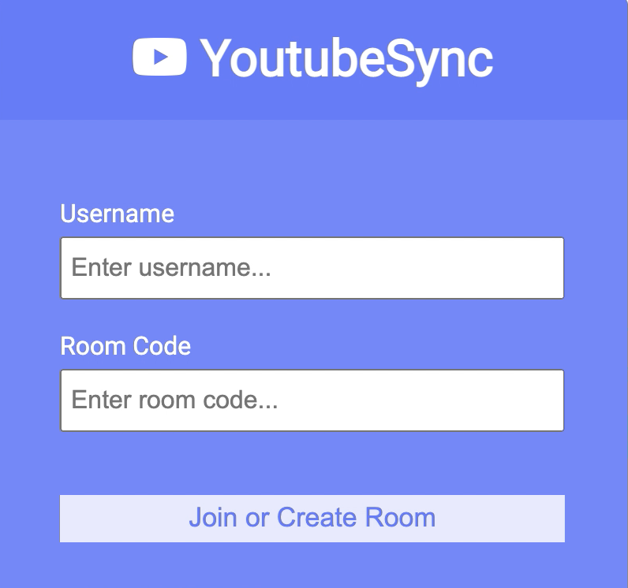

# YouTubeSync 

### Introduction
Have you ever wanted to watch a YouTube video with a friend, but it was just too much of a hassle to setup your videos at the same time? YouTubeSync is
a Chrome Extension that allows a group of users to watch their YouTube videos synchronously while in the same session.  

### Technology Stack
The frontend was created using HTML/CSS/JavaScript and Chrome Extension APIs. While the backend was developed with Socket.IO, Node.js, Express.js, and is hosted on Heroku.

### How it Works
Once the Chrome Extension is installed, whenever the user opens YouTubeSync, they will immediately connect to the server (hosted on Heroku). Users then encounter a responsive
interface that prompts them for a username and room code. The user can either join an already existing room code or make their own to create a room.

  

Afterwards, users are introduced to the room interface, where they have the option of leaving the room. The extension works by establishing a room leader, which 
is the person who created the room. The room leader has full control of the time code of the video and other features such as pausing and skipping. For example, when
the leader skips the video to 12:48, then the rest of the room members also have their videos skip to 12:48. If the leader leaves the room, then the first user that
joined after the leader is promoted.

  

Visit the following <a href="https://www.youtube.com/watch?v=buGNYB5Scd0" target="_blank" rel="noopener noreferrer" >link</a> for a video demonstration of the extension.

Note, will be published on chrome store shortly. Need to deal with a few picky chrome store rules before it can be accepted!
